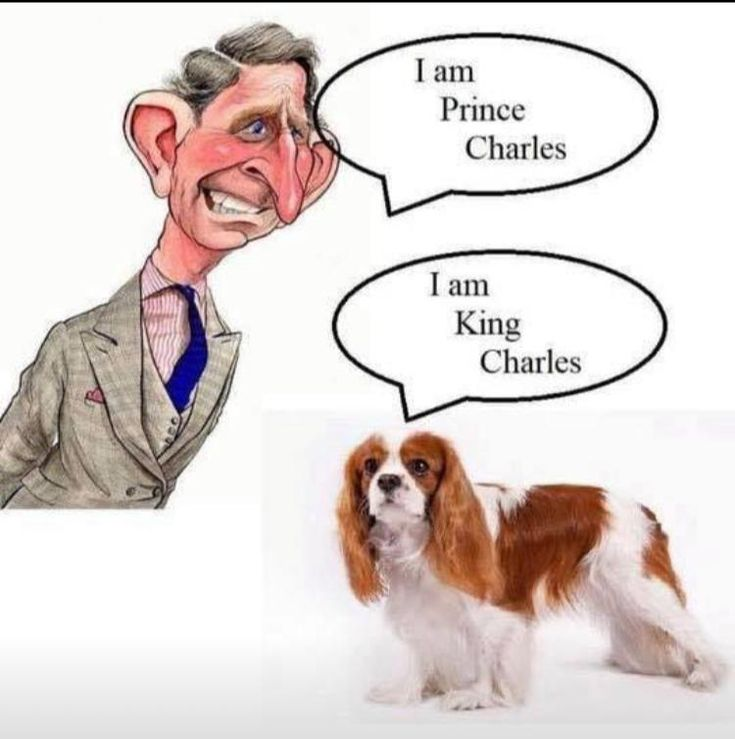

# 🐶 About King Charles Spaniel

**What is a meme coin?**\
****\
**** Meme coin is a type of cryptocurrency inspired by memes. Check out some of its characteristics:

**Viral-Based**

This type of digital asset is based on humor, on the "fun" of social networks and online discussion forums. Meme coins usually emerge from virals, just like the examples above.

These can be an event, an image, an opinion from an influencer, a video, a tweet...

The valuation of gem-currencies is strongly linked to the excitement of an online community about a certain topic. They ride the wave of the moment.

<figure><figcaption></figcaption></figure>

